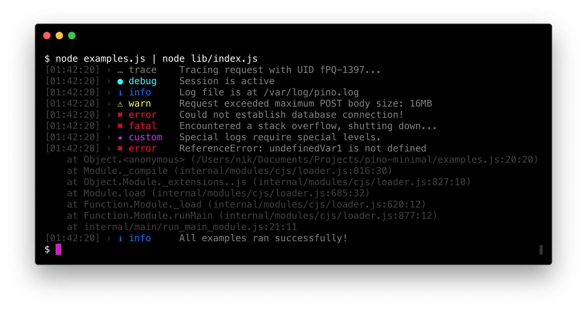

# pino-minimal
> A beautiful and minimal transport for pino

<div align="center">
    
</div>

<p align="center">
    <a href="https://travis-ci.org/NikxDa/pino-minimal">
        
    </a>
</p>

## Description

The `pino-minimal` transport provides a prettified, minimalistic and beautiful output for [Pino.js](https://github.com/pinojs/pino). It's output is strongly inspired by [Signale](https://github.com/klaussinani/signale).

## Contents

- [Description](#description)
- [Installation](#installation)
- [Usage](#usage)
- [License](#license)

## Installation

### NPM

```bash
$ npm install -g pino-minimal
```

### Yarn

```bash
$ yarn global add pino-minimal
```

## Usage

To use it, simply pipe the output from Pino into this transport. Example:

```bash
$ node server.js | pino-minimal
```

This package accepts several arguments to change the logging behaviour:

- `--date`: Adds a date to the displayed timestamp
- `--minimal`: Removes timestamps

## License

MIT